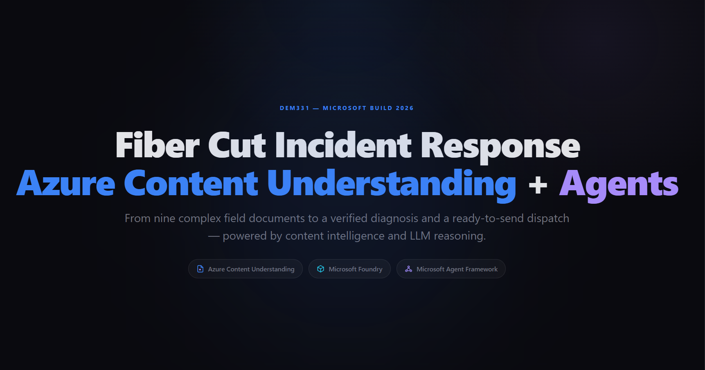
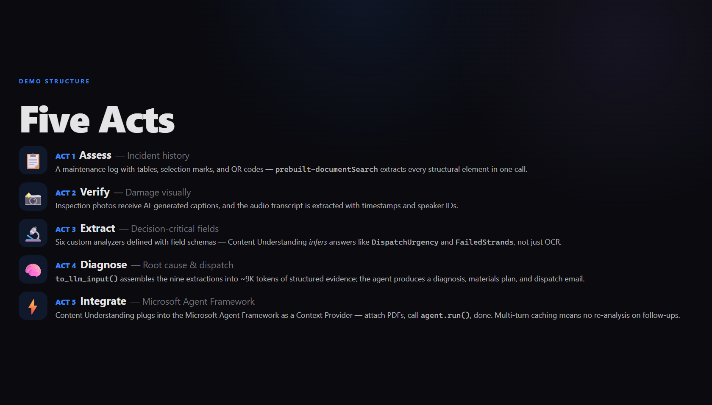
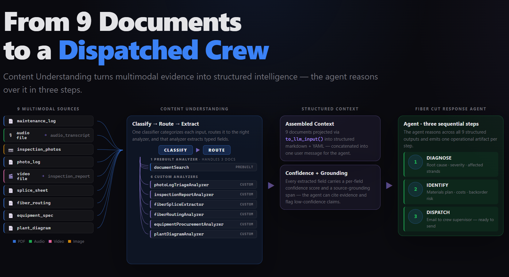
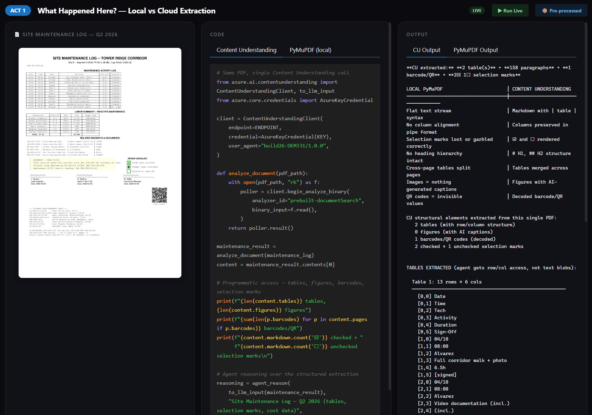

<a name="start-building"></a>
<br>
<p align="center">

</p>

# [Microsoft Build 2026](https://build.microsoft.com)

## 🔥 DEM331: Turn APIs, Tools, and Data into Real Agent Velocity

### Session Description

Building high-quality agentic applications requires well-structured data — but real-world data is often multi-modal, unorganized, and error-prone. In this demo, a **Fiber Cut Response Agent** triages a critical network incident end-to-end: complex field documents (PDFs with tables, photos, engineering diagrams, splice sheets, and audio transcripts) are processed by **Azure Content Understanding** using prebuilt and custom analyzers, then reasoned over by an LLM (Foundry model) to produce a root cause diagnosis, materials plan, and crew dispatch email. The demo also shows how the **Microsoft Agent Framework** wraps Content Understanding into a reusable context provider for multi-turn agent conversations with automatic analysis and caching.

<p align="center">
  
</p>

### What's in this repo

| Folder | Purpose |
|---|---|
| [`src/`](src/) | The **source notebook** — `demo_fiber_cut_MAF.ipynb` walks through all five acts end-to-end. Best place to start. |
| [`demo-app/`](demo-app/) | A **Dash presentation app** that combines the HTML slide deck with interactive "live code" pages for each act. This is what's used on stage. |
| [`src/sample-data/documents/`](src/sample-data/documents/) | The 9 field documents (PDFs) used throughout the demo. |

### The Demo at a Glance

The five acts of the demo, end-to-end:

<p align="center">
  
</p>

The architecture: nine multi-modal documents flow through Content Understanding's classify-route-extract pipeline, into structured agent context, and out as a dispatched repair crew.

<p align="center">
  
</p>

The interactive demo app shows the source document, the code, and the output side-by-side — toggle between pre-processed and live execution.

<p align="center">
  
</p>

### 🚀 Getting started

If you're following these steps at your own pace:

**Option A — Run the source notebook** (recommended for learning)

1. Clone this repository
2. Install Python dependencies:
   ```bash
   pip install azure-ai-contentunderstanding --pre pymupdf python-dotenv openai agent-framework-azure-contentunderstanding agent-framework-foundry --pre
   ```
3. Create a `.env` file in the `src/` folder with your Azure Content Understanding endpoint and key:
   ```
   CONTENTUNDERSTANDING_ENDPOINT=https://<your-resource>.services.ai.azure.com/
   CONTENTUNDERSTANDING_KEY=<your-key>   # or omit to use DefaultAzureCredential
   ```
4. Open [`src/demo_fiber_cut_MAF.ipynb`](src/demo_fiber_cut_MAF.ipynb) and run cells sequentially

**Option B — Run the interactive demo app** (the on-stage experience)

```bash
cd demo-app
uv run python app.py
```

Then open <http://localhost:8050> and press **F11** for fullscreen. See [`demo-app/README.md`](demo-app/README.md) for details on the 27-frame sequence, live execution mode, and the one-time analyzer deploy script.

### 🧠 Learning Outcomes

By the end of this demo, you will be able to:

- Compare local PDF extraction (PyMuPDF) versus Azure Content Understanding for structured data recovery — tables, selection marks, figures, and barcodes
- Use `prebuilt-documentSearch` for general-purpose extraction and define **custom analyzers** with inferred fields that reason about document content, not just extract text
- Build a document **classifier** that routes unknown documents to the correct custom analyzer in a single API call
- Use `to_llm_input()` to convert Content Understanding results into token-efficient LLM context with metadata and markdown control
- Integrate Content Understanding into the **Microsoft Agent Framework** as a context provider for automatic analysis, formatting, and multi-turn caching

### 💬 Keep Learning with Copilot

Try these prompts with GitHub Copilot to explore the topics from this demo. Open Copilot Chat in Visual Studio Code (`Ctrl+Alt+I` on Windows/Linux, `Cmd+Shift+I` on Mac), paste a prompt, and see what you learn. Try connecting the [Microsoft Learn MCP Server](#-microsoft-learn-mcp-server) for the latest official documentation.

Use these as a starting point — or write your own!

1. Understand the basics:

```
Explain how Azure Content Understanding custom analyzers differ from prebuilt analyzers. When would I define my own field schema with "method": "generate"?
```

2. Go deeper:

```
Using the Microsoft Learn MCP Server, find the latest documentation on Azure Content Understanding and walk me through how to create a document classifier that routes to different custom analyzers.
```

3. Build something:

```
Help me create a Python script that uses azure-ai-contentunderstanding to analyze a PDF with a custom analyzer, then formats the result with to_llm_input() and sends it to Azure OpenAI for reasoning.
```

### 💻 Technologies Used

1. [Azure Content Understanding](https://learn.microsoft.com/azure/ai-services/content-understanding/overview)
1. [Microsoft Agent Framework](https://learn.microsoft.com/agent-framework/)
1. [Azure OpenAI Service](https://learn.microsoft.com/azure/ai-services/openai/overview)
1. [Azure AI Foundry](https://learn.microsoft.com/azure/foundry/what-is-foundry)
1. [Python SDK: azure-ai-contentunderstanding](https://pypi.org/project/azure-ai-contentunderstanding/)

### 📚 Resources and Next Steps

| Resource | Description |
|:---------|:------------|
| [https://aka.ms/build26-next-steps](https://aka.ms/build26-next-steps) | Explore lab and session repos to further your learning from Microsoft Build |

### 👤 Content Owners

<!-- Content owners -->

<table>
<tr>
    <td align="center"><a href="https://github.com/chulahlou">
        <br />
        <sub><b>Chu Lahlou</b></sub></a>
    </td>
</tr>
</table>


### 🌟 Microsoft Learn MCP Server

The Microsoft Learn MCP Server gives your AI agent direct access to Microsoft's official documentation — grounded, up-to-date answers about the products and services covered in this demo.

**VS Code** — One click installation: 

[](https://vscode.dev/redirect/mcp/install?name=microsoft-learn&config=%7B%22type%22%3A%22http%22%2C%22url%22%3A%22https%3A%2F%2Flearn.microsoft.com%2Fapi%2Fmcp%22%7D)


**GitHub Copilot CLI** — Run this to install the Learn MCP Server as a plugin:
```
/plugin install microsoftdocs/mcp
```

For more info, other clients, and to post questions, visit the [Learn MCP Server repo](https://aka.ms/learnmcp).

## Contributing

This project welcomes contributions and suggestions.  Most contributions require you to agree to a
Contributor License Agreement (CLA) declaring that you have the right to, and actually do, grant us
the rights to use your contribution. For details, visit [Contributor License Agreements](https://cla.opensource.microsoft.com).

When you submit a pull request, a CLA bot will automatically determine whether you need to provide
a CLA and decorate the PR appropriately (e.g., status check, comment). Simply follow the instructions
provided by the bot. You will only need to do this once across all repos using our CLA.

This project has adopted the [Microsoft Open Source Code of Conduct](https://opensource.microsoft.com/codeofconduct/).
For more information see the [Code of Conduct FAQ](https://opensource.microsoft.com/codeofconduct/faq/) or
contact [opencode@microsoft.com](mailto:opencode@microsoft.com) with any additional questions or comments.

## Trademarks

This project may contain trademarks or logos for projects, products, or services. Authorized use of Microsoft
trademarks or logos is subject to and must follow
[Microsoft's Trademark & Brand Guidelines](https://www.microsoft.com/legal/intellectualproperty/trademarks/usage/general).
Use of Microsoft trademarks or logos in modified versions of this project must not cause confusion or imply Microsoft sponsorship.
Any use of third-party trademarks or logos are subject to those third-party's policies.
